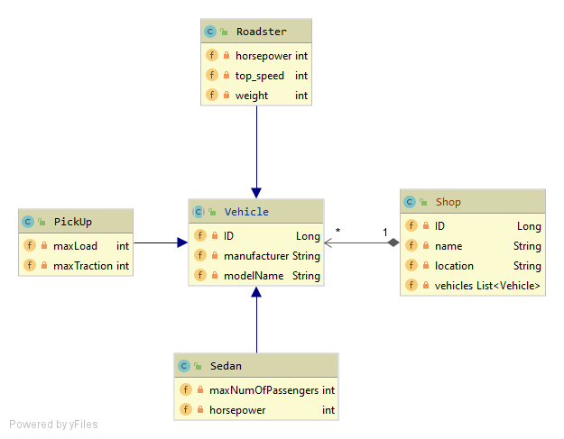

= Miniprojekt: Autohandl - Nenad Tripić - 5BHIF 2019/2020
Nenad Tripić  <tripicnenad@hotmail.com>
v1.0, 2020-03-23
:toc:
:toc-title: Inhaltsverzeichnis
:toclevels: 3

ifdef::env-github[]
:tip-caption: :bulb:
:note-caption: :information_source:
:important-caption: :heavy_exclamation_mark:
:caution-caption: :fire:
:warning-caption: :warning:
endif::[]

=== Worum handelt dieses Projekt?
Das Miniprojekt handelt um eine Autohandlung. Man kann Fahrzeuge und Authäuser via REST Abfragen.
Das Projekt dient hauptsächlich zum Testen von verschieden Dingen die im Unterricht besprochen wurden.
Eine Übersicht über alle Schnittstellen sind einsehbar wenn die Applikation *läuft* unter folgenden Links:

*OpenAPI:* http://localhost:8080/openapi

*Swagger-UI:* http://localhost:8080/swagger-ui/#/

=== Wie starte ich das Projekt?
. Starten eines Postgres-Dockercontainers mit
+
----
docker run --name some-postgres -p 5432:5432 -e POSTGRES_PASSWORD=passme -d postgres
----
. Starten der Quarkus Applikation mit CLI (unter Windows mit Systemumgebungsvariablen)
----
%mvn% clean compile quarkus:dev
----

=== EntityGraph
In diesem Projekt wurde EntityGraph implementiert. Als Vorlage/Referenz diente dieser Link von https://www.baeldung.com/jpa-entity-graph[Baeldung].
Dieser fasst alles Wichtige zusammen und gibt ein Praxisbeispiel.

=== Implementierung von OpenAPI & Swagger
. In der link:vehicle/pom.xml[pom.xml] folgende Dependency hinzufügen
+
----
<dependency>
    <groupId>io.quarkus</groupId>
    <artifactId>quarkus-smallrye-openapi</artifactId>
</dependency>
----
. In der link:vehicle/src/main/resources/application.properties[Konfigurationsdatei] folgendes eintragen
----
#OpenApi & Swagger
#OpenAPI: http://localhost:8080/openapi
#Swagger-UI: http://localhost:8080/swagger-ui/#/
quarkus.swagger-ui.always-include=true
----

=== CLD von der Applikation
